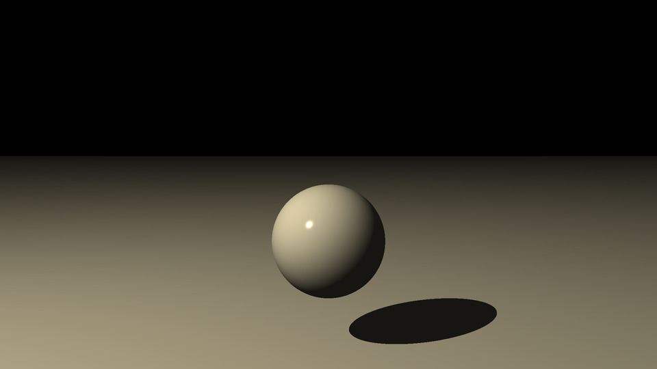

# Ray Tracer

Based off of the ray tracer in Jamis Buck's book,
[*The Ray Tracer Challenge*](http://raytracerchallenge.com/).

Implemented in Rust.

## Features

This crate implements the features in every chapter of *The Ray Tracer
Challenge*, plus a few more. Extra features include:

    * Bounding boxes for (most) primitive shapes, including triangles

    * Parent transformation pre-computation on group objects

    * Inverse transformation cacheing on shapes

    * Multi-threaded rendering

    * Mostly complete documentation of major ray tracing components

Parent transformations are pre-computed to avoid using a bidirectional tree to
represent shape hierarchies. Fortunately, this also yields a performance
speedup, despite being more "rigid."

## Usage

The executable can be built and ran using `cargo`:

```sh
cargo run --release
```

By default, the executable will render a sample scene in main with only one
thread. The scene will be output to file `out.ppm`

If your CPU has more than one core/hyper-thread available, you can render using
multiple threads (the below command uses three threads):

```sh
cargo run --release -- -j 3
```

To output the render to a different file, you can use the `-o` flag (currently
only PPM files are supported):

```sh
cargo run --release -- -j 3 -o example.ppm
```

## Scenes

Scenes consist of a camera and a world of objects, specified by the user. Scene
descriptions are represented with JSON files. For example, scene
`scenes/example.json` looks like the following:

```json
{
    "canvas_width": 1920,
    "canvas_height": 1080,
    "field_of_view": 1.0472,
    "camera_from": [0.0, 1.5, -10.0],
    "camera_to": [0.0, 1.0, 0.0], 
    "camera_up": [0.0, 1.0, 0.0],

    "light": {
        "intensity": [0.85, 0.8, 0.65],
        "position": [-10.0, 10.0, -10.0, 1.0]
    },

    "shapes": [
        {
            "ty": "sphere",
            "transform": [ 1.0, 0.0, 0.0, 0.0,
                           0.0, 1.0, 0.0, 0.0,
                           0.0, 0.0, 1.0, 0.0,
                           0.0, 0.0, 0.0, 1.0 ]
        },

        {
            "ty": "plane",
            "transform": [ 1.0, 0.0, 0.0,  0.0,
                           0.0, 1.0, 0.0, -2.0,
                           0.0, 0.0, 1.0,  0.0,
                           0.0, 0.0, 0.0,  1.0 ]
        }
    ]
}
```

In the above example, the camera parameters are specified first. Then, a light
is added to the world (without a light, the world will be pitch black). Finally,
shapes are added to the world, giving the ray tracer something to render.

The above example produces a plain white plane with an ominous sphere looming
above it. The user can render the example scene with the following command from
the project root:

```sh
cargo run --release -- -s scenes/example.json -j 3
```

After running the above command, the following image should be produced.

 

## Acknowledgements

Credit to Jamis Buck for [*The Ray Tracer
Challenge*](http://raytracerchallenge.com/). This textbook is amazing, I highly
recommend it.

Credit to the [Ray Tracer Challenge
Forum](https://forum.raytracerchallenge.com/) as well. The users of this forum
are awesome. Super helpful for debugging and optimization help.

## Contributing

If you see any mistakes, or would like to add features to this project, feel
free to create an issue or pull request.
